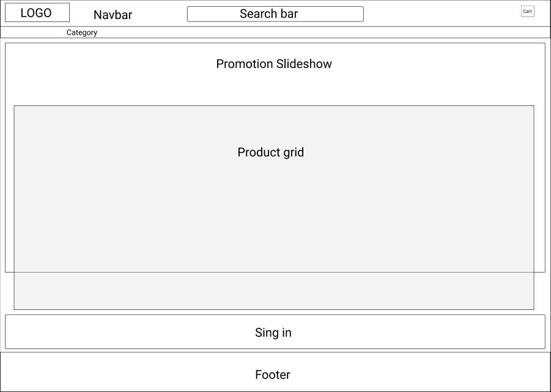

# Design

## Project's design overview

> Give an overview of your project's design

- **Color Palette:** Amazon color palette.
- **Typography:** Amazon typography.
- **Grid System:** A flexible grid-based layout ensuring responsiveness across
  different screen sizes.

---

## Wireframe(s)

> Include your wireframe(s) and link to wireframe

